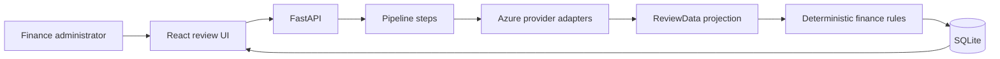

# Target architecture

Invoice Review is a small local full-stack application. Maya uploads a multilingual invoice or receipt, reviews a prepared extraction with policy findings and a GL suggestion, corrects fields when needed, then approves or rejects.

## Intended boundaries

- Provider adapters normalize Azure responses before data reaches the domain (`providers/` and thin `services/` clients).
- Deterministic invoice and receipt rules remain separate from model extraction (`documents/validation.py`).
- Routes own HTTP concerns, a service owns orchestration, and a repository owns SQLite access under `documents/`.
- The ordered Azure workflow lives in `pipeline/` steps (classify → extract → LLM review/merge → validate → GL).
- Environment values are read through one backend settings module and one frontend environment module.
- A person approves, rejects, or requests a supplier correction after seeing evidence and uncertainty.

## Target flow

## Persistence shape

Stage columns keep the teaching story visible (`classification`, `extraction`, `validation`, `gl_suggestion`). The editable review projection is stored as `review_data`, with `document_review`, `accounting_coding`, and `issues` for Maya’s decision loop.
